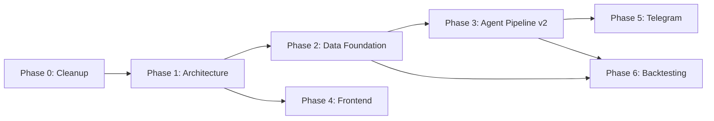

# Bruno Trading Platform — Master Architecture Plan

> **Vom Prototyp zur robusten, transparenten Trading-Plattform**
>
> Erstellt: 2026-03-26 | Architektur-Review nach vollständiger Code-Analyse

---

## Versions-Info

| Attribut | Wert |
|----------|------|
| **Version** | `0.3.0` |
| **Codename** | Bruno UI Modernization |
| **Status** | Phase 4.6 abgeschlossen — Log-System & Transparenz stabilisiert |
| **Letztes Update** | 2026-03-26 |
| **Repository** | https://github.com/Kazuo3o447/Bruno |

---

## Ehrlicher Ist-Stand (vor Cleanup)

> Was tatsächlich steht vs. was die alte Dokumentation behauptet hat.

### ✅ Was wirklich funktioniert
- [x] Docker Compose mit 4 Containern (PostgreSQL, Redis, FastAPI, Next.js)
- [x] FastAPI Backend mit Health-Check, CORS, WebSocket-Endpoints, Backup-API
- [x] PostgreSQL/TimescaleDB + pgvector — Schema angelegt (6 Models, 9 Tabellen)
- [x] Redis Singleton Client mit Connection Pool, Pub/Sub, Caching
- [x] Ollama Client Wrapper (httpx async, qwen2.5/deepseek-r1)
- [x] Ingestion Agent — Binance WebSocket mit Exponential Backoff (funktioniert)
- [x] Quant Agent — RSI(14) mit NumPy, publiziert auf Redis (bereinigt & aktiv)
- [x] Next.js Frontend mit harmonisiertem Sidebar-Layout (RootLayout)
- [x] Agenten-Zentrale mit Chat, Steuerungs-Panel und Transparenz-Modals
- [x] Modernes Log-Terminal mit WebSocket-Streaming & Filtern
- [x] Lightweight Charts Integration (v5 API fix)
- [x] Real-time WebSocket Client im Frontend (Ticker & Logs)
- [x] Alembic Migrations
- [x] Smart Backup System (pg_dump -Z 9, Frontend-UI)
- [x] Log Manager (Redis-basiert, 24h Persistenz + Pub/Sub)
- [x] System-Health Monitoring (Healthy/Degraded/Error Status)
- [x] Trade-Marker auf dem Chart
- [x] Systemtest Scheduler (inkl. CryptoPanic Healthcheck)

### ⚠️ Was existiert aber kaputt/unvollständig ist
- [/] Quant Agent — `quant_new.py` existiert noch, `quant.py` hat falsches Interface (`run_analysis_loop`/`close`)
- [/] Sentiment Agent — nutzt CryptoPanic API (Key hinterlegt, Logik in Phase 3)
- [/] Risk Agent — prüft nur `quant == sentiment`, kein echtes Risk-Management
- [/] Execution Agent — loggt Trades mit `price = 0.0` (Dummy-Preis)
- [x] Redis Image — Upgrade auf `redis/redis-stack` abgeschlossen
- [x] Config — Pydantic Settings refactored, Overrides bereinigt
- [x] Sidebar — Alle 6 Links führen auf existierende Seiten
- [x] Docker — Healthchecks & Lifecycle-Management implementiert
- [/] Alle 5 Agenten laufen im selben FastAPI-Prozess (Isolation in Phase 1)

### ❌ Was fehlt
- [ ] Historische Daten-Pipeline
- [ ] Multi-Timeframe Candles
- [ ] Echte Sentiment-Quellen (CryptoPanic, RSS)
- [ ] Echtes Risk-Management (Stop-Loss, Position Sizing, Daily Limits)
- [ ] Trade-Transparenz (warum wurde gehandelt?)
- [ ] Performance-Tracking (P&L, Sharpe, Drawdown)
- [ ] Telegram-Integration
- [ ] Backtesting Engine
- [ ] Tests (Unit, Integration)
- [ ] Agent-Prozess-Isolation

---

## Abgeschlossene Legacy-Phasen

### Phase 1 (Legacy): Infrastruktur ✅
- [x] Docker-Compose-Dateien
- [x] PostgreSQL + TimescaleDB Setup
- [x] Redis Integration
- [x] Netzwerk-Testing (host.docker.internal)
- [x] Ollama-Verbindung
- [x] Backup System

### Phase 2 (Legacy): Backend & API ✅
- [x] FastAPI Projektstruktur
- [x] Health-Check Endpoint
- [x] Backup API
- [x] CORS Middleware
- [x] Datenbank-Models (SQLAlchemy 2.0 async)
- [x] Redis-Connector (Singleton)
- [x] Ollama-Client-Wrapper
- [x] WebSocket-Endpoints
- [x] Startup/Shutdown Events

### Phase 3 (Legacy): Frontend ✅
- [x] Next.js Setup (Tailwind, TypeScript)
- [x] Sidebar Navigation
- [x] Backup-Page UI
- [x] Dashboard-Layout
- [x] Chart-Integration (Lightweight Charts)
- [x] WebSocket-Client
- [x] Agenten-Status-Monitor

### Phase 4 (Legacy): Agenten ⚠️ TEILWEISE (wird in Phase 0-3 neu aufgebaut)
- [x] Ingestion Agent — funktioniert
- [x] Quant Agent — funktioniert, aber doppelt
- [/] Sentiment Agent — Dummy-Daten
- [/] Risk Agent — zu simpel
- [/] Execution Agent — kein echter Preis
- [x] Frontend Agenten-Dashboard

---

## Designprinzipien

Bevor wir in Phasen denken, die Leitplanken die **jede** Entscheidung leiten:

| Prinzip | Bedeutung |
|---|---|
| **Transparency First** | Jede Trade-Entscheidung muss nachvollziehbar sein — welche Signale, welche Konfidenz, warum |
| **Crash Isolation** | Ein fehlerhafter Agent darf nie die API oder andere Agenten mitreißen |
| **Honest State** | Dokumentation spiegelt exakt den Ist-Zustand — keine "✅ PRODUKTIVBEREIT" wenn Dummy-Daten laufen |
| **Multi-Asset Ready** | Architektur von Tag 1 für mehrere Assets designt, aber BTC/USDT als Erstes |
| **Observable** | Alles was passiert ist sichtbar — Dashboard, Logs, Telegram |
| **Pragmatic Complexity** | Nur so komplex wie nötig. Privates Projekt, keine Enterprise-Overengineering |

---

## Ziel-Architektur (nach allen Phasen)

```
┌─────────────────────────────────────────────────────────────────┐
│                        Windows Host                              │
│                                                                   │
│  ┌─────────────────────────────────────────────────────────┐    │
│  │                Docker Desktop (WSL2)                      │    │
│  │                                                           │    │
│  │  ┌───────────┐  ┌────────────┐  ┌───────────────────┐   │    │
│  │  │ Redis     │  │ PostgreSQL │  │ bruno-api         │   │    │
│  │  │ Stack     │  │ TimescaleDB│  │ FastAPI           │   │    │
│  │  │ :6379     │  │ + pgvector │  │ :8000             │   │    │
│  │  │           │  │ :5432      │  │ API + WebSocket   │   │    │
│  │  └─────┬─────┘  └─────┬──────┘  └────────┬──────────┘   │    │
│  │        │               │                   │              │    │
│  │        │         Redis Pub/Sub             │              │    │
│  │        │               │                   │              │    │
│  │  ┌─────┴───────────────┴───────────────────┴──────────┐  │    │
│  │  │              bruno-worker                           │  │    │
│  │  │         Agent Orchestrator Process                  │  │    │
│  │  │                                                     │  │    │
│  │  │  ┌──────────┐ ┌──────┐ ┌─────────┐ ┌────┐ ┌────┐ │  │    │
│  │  │  │Ingestion │ │Quant │ │Sentiment│ │Risk│ │Exec│ │  │    │
│  │  │  └──────────┘ └──────┘ └─────────┘ └────┘ └────┘ │  │    │
│  │  └─────────────────────────────────────────────────────┘  │    │
│  │                                                           │    │
│  │  ┌───────────────────┐  ┌───────────────────┐            │    │
│  │  │ bruno-frontend    │  │ bruno-telegram     │            │    │
│  │  │ Next.js :3000     │  │ Notification Bot   │            │    │
│  │  └───────────────────┘  └───────────────────┘            │    │
│  └─────────────────────────────────────────────────────────┘    │
│                                                                   │
│  ┌─────────────────────────────────────────────────────────┐    │
│  │            Ollama (native Windows)                        │    │
│  │            AMD RX 7900 XT GPU                             │    │
│  │            http://localhost:11434                          │    │
│  └─────────────────────────────────────────────────────────┘    │
└─────────────────────────────────────────────────────────────────┘
```

**Kernänderung**: FastAPI und Agenten laufen in **getrennten Containern** (gleiche Codebase, verschiedene Entrypoints). Die API bleibt responsiv, egal was die Agenten tun.

---

## Phase 0: Foundation Cleanup

> **Ziel**: Stabiles, ehrliches Fundament. Alles was kaputt oder gelogen ist wird gefixt.

### 0.1 Doppelten Quant Agent entfernen ⚠️

| Task | Status |
|---|---|
| `quant_new.py` löschen | [ ] **Datei existiert noch im Repo** |
| `quant.py` Interface fixen (`start()`/`stop()`) | [ ] Hat `run_analysis_loop()`/`close()` statt `start()`/`stop()` |
| `main.py` Referenzen konsistent machen | [/] Importiert `quant.py`, ruft aber `start()` auf das nicht existiert |

### 0.2 Redis Image fixen ✅
- Umstellung auf `redis/redis-stack-server:latest` erfolgreich abgeschlossen.
- Module (JSON, Search) sind aktiv.

### 0.3 Config-Hack aufräumen ✅
- Pydantic Settings implementiert.
- `CRYPTOPANIC_API_KEY` sicher in `.env` hinterlegt.
- Redundante Overrides für `OLLAMA_HOST` entfernt.

### 0.4 Sidebar-Routing fixen ✅

| Sidebar-Link | Route | Status |
|---|---|---|
| `/` → Dashboard | `/` | ✅ |
| `/agenten` → Agenten | `/agenten` | ✅ |
| `/dashboard` → Trading | `/dashboard` | ✅ |
| `/backup` → Datensicherung | `/backup` | ✅ |
| `/logs` → Aktivitäten | `/logs` | ✅ |
| `/einstellungen` → Einstellungen | `/einstellungen` | ✅ |

### 0.5 Docker Healthchecks ✅
- Healthchecks für Postgres und Redis aktiv.
- `depends_on` mit Lifecycle-Condition konfiguriert.
- Systemtests für CryptoPanic API integriert.

### 0.6 Dokumentation ehrlich machen ✅

- [x] `Status.md`: Alle falschen "✅ BESTANDEN" durch tatsächlichen Stand ersetzt
- [x] `agent.md`: Überschrieben mit ehrlichem Ist-Stand und Phase-1-Verweis
- [x] `arch.md`: System-Status auf Phase-0-Stand aktualisiert
- [x] `ki.md`: Komplett neu geschrieben mit vollständigem Agenten-Implementierungsplan

### Phase 0 — Verifizierung
```
- [x] `docker compose up -d` startet ohne Fehler
- [x] Nur EIN Quant-Agent publiziert auf signals:quant
- [x] redis-cli MODULE LIST zeigt RedisJSON, RediSearch
- [x] Alle 6 Sidebar-Links führen auf existierende Seiten
- [x] Health-Check wartet auf DB/Redis bevor API startet
- [x] Systemtest prüft CryptoPanic API Erreichbarkeit (mit Key)
```

---

## Phase 1: Architecture Refactoring

> **Ziel**: API und Agenten trennen. Agent-Lifecycle sauber managen. Klare Kommunikationsverträge.

### 1.1 Zwei-Container-Architektur

**Gleiche Codebase, zwei Entrypoints:**

```
backend/
├── app/
│   ├── main.py              # FastAPI Entrypoint (API only)
│   ├── worker.py             # [NEU] Agent Orchestrator Entrypoint
│   ├── agents/
│   │   ├── base.py           # [NEU] BaseAgent Klasse
│   │   ├── orchestrator.py   # [NEU] Agent Lifecycle Manager
│   │   ├── ingestion.py      # Refactored
│   │   ├── quant.py          # Refactored (ex quant_new.py)
│   │   ├── sentiment.py      # Refactored
│   │   ├── risk.py           # Refactored
│   │   └── execution.py      # Refactored
│   ├── core/
│   │   ├── config.py         # Bereinigt
│   │   ├── database.py       # Unverändert
│   │   ├── redis_client.py   # Erweitert
│   │   ├── llm_client.py     # Unverändert
│   │   ├── log_manager.py    # Unverändert
│   │   └── contracts.py      # [NEU] Message Schemas
│   ├── routers/              # Nur API-Routen, keine Agent-Logik
│   ├── schemas/
│   └── utils/
```

**docker-compose.yml erweitert:**
```yaml
  bruno-api:
    build:
      context: ./backend
      dockerfile: ../docker/Dockerfile.backend
    command: uvicorn app.main:app --host 0.0.0.0 --port 8000
    # ... NUR API, keine Agenten

  bruno-worker:
    build:
      context: ./backend
      dockerfile: ../docker/Dockerfile.backend
    command: python -m app.worker
    # ... NUR Agenten, keine API
    restart: unless-stopped
    depends_on:
      bruno-api:
        condition: service_healthy
```

### 1.2 BaseAgent Klasse

```python
# backend/app/agents/base.py
from abc import ABC, abstractmethod
from datetime import datetime, timezone
import asyncio
import logging
import traceback
from app.core.redis_client import redis_client
from app.core.contracts import AgentHeartbeat

class BaseAgent(ABC):
    """Basis für alle Bruno-Agenten. Jeder Agent MUSS diese Klasse erweitern."""
    
    def __init__(self, agent_id: str, config: dict = None):
        self.agent_id = agent_id
        self.config = config or {}
        self._running = False
        self._error_count = 0
        self._consecutive_errors = 0
        self._processed_count = 0
        self._start_time = None
        self._max_consecutive_errors = 10
        self.logger = logging.getLogger(f"agent.{agent_id}")
    
    @abstractmethod
    async def process(self) -> None:
        """Einzelner Verarbeitungszyklus. Wird vom Run-Loop aufgerufen."""
        pass
    
    @abstractmethod
    def get_interval(self) -> float:
        """Sleep-Intervall zwischen process()-Aufrufen in Sekunden."""
        pass
    
    async def setup(self) -> None:
        """Einmalige Initialisierung (Warmup, Connections). Optional."""
        pass
    
    async def teardown(self) -> None:
        """Cleanup beim Stoppen. Optional."""
        pass
    
    async def run(self) -> None:
        """Hauptschleife mit Error-Handling, Heartbeat, Auto-Restart."""
        self._running = True
        self._start_time = datetime.now(timezone.utc)
        
        try:
            await self.setup()
            self.logger.info(f"Agent {self.agent_id} gestartet")
        except Exception as e:
            self.logger.error(f"Setup fehlgeschlagen: {e}")
            return
        
        while self._running:
            try:
                await self._heartbeat()
                await self.process()
                self._processed_count += 1
                self._consecutive_errors = 0  # Reset bei Erfolg
            except Exception as e:
                self._error_count += 1
                self._consecutive_errors += 1
                self.logger.error(f"Process error: {e}\n{traceback.format_exc()}")
                await self._report_error(e)
                
                if self._consecutive_errors >= self._max_consecutive_errors:
                    self.logger.critical(
                        f"Agent {self.agent_id}: {self._max_consecutive_errors} "
                        f"Fehler in Folge — Agent wird pausiert"
                    )
                    await asyncio.sleep(300)  # 5 Minuten Pause
                    self._consecutive_errors = 0
            
            await asyncio.sleep(self.get_interval())
        
        await self.teardown()
        self.logger.info(f"Agent {self.agent_id} gestoppt")
    
    async def stop(self) -> None:
        self._running = False
    
    async def _heartbeat(self) -> None:
        """Meldet Agent-Status an Redis."""
        heartbeat = AgentHeartbeat(
            agent_id=self.agent_id,
            status="running" if self._running else "stopped",
            uptime_seconds=(datetime.now(timezone.utc) - self._start_time).total_seconds(),
            processed_count=self._processed_count,
            error_count=self._error_count,
            consecutive_errors=self._consecutive_errors,
            timestamp=datetime.now(timezone.utc).isoformat()
        )
        await redis_client.set_cache(
            f"heartbeat:{self.agent_id}", 
            heartbeat.model_dump(), 
            ttl=60  # Wenn 60s kein Heartbeat → Agent gilt als tot
        )
    
    async def _report_error(self, error: Exception) -> None:
        """Publiziert Fehler für Monitoring."""
        await redis_client.publish_message("alerts:agent_error", json.dumps({
            "agent_id": self.agent_id,
            "error": str(error),
            "traceback": traceback.format_exc(),
            "timestamp": datetime.now(timezone.utc).isoformat(),
            "consecutive": self._consecutive_errors
        }))
```

### 1.3 Agent Orchestrator

```python
# backend/app/worker.py
"""
Bruno Agent Worker — Separater Prozess für alle Trading-Agenten.
Gestartet via: python -m app.worker
"""

class AgentOrchestrator:
    """Verwaltet den Lifecycle aller Agenten."""
    
    def __init__(self):
        self.agents: Dict[str, BaseAgent] = {}
        self.tasks: Dict[str, asyncio.Task] = {}
    
    def register(self, agent: BaseAgent):
        self.agents[agent.agent_id] = agent
    
    async def start_all(self):
        for agent_id, agent in self.agents.items():
            task = asyncio.create_task(agent.run())
            self.tasks[agent_id] = task
    
    async def restart_agent(self, agent_id: str):
        """Einzelnen Agent neustarten ohne andere zu beeinflussen."""
        if agent_id in self.tasks:
            self.agents[agent_id].stop()
            await self.tasks[agent_id]  # Warten bis beendet
            # Neustarten
            task = asyncio.create_task(self.agents[agent_id].run())
            self.tasks[agent_id] = task
    
    async def listen_for_commands(self):
        """Lauscht auf Redis für Restart/Stop-Befehle vom API-Container."""
        pubsub = await redis_client.subscribe_channel("worker:commands")
        # ... parse commands like restart, stop, pause
```

### 1.4 Redis Message Contracts

> [!IMPORTANT]
> **Alle** Inter-Agent-Kommunikation folgt strikten Schemas. Keine lose JSON-Strings mehr.

```python
# backend/app/core/contracts.py
"""Verbindliche Nachrichtenformate für das gesamte System."""

from pydantic import BaseModel, Field
from typing import Optional, List, Dict, Any
from datetime import datetime
from enum import Enum
import uuid

class SignalDirection(str, Enum):
    BUY = "BUY"
    SELL = "SELL"
    HOLD = "HOLD"

class SignalEnvelope(BaseModel):
    """Standard-Hülle für JEDES Signal im System."""
    correlation_id: str = Field(default_factory=lambda: str(uuid.uuid4()))
    agent_id: str
    version: str = "2.0"
    timestamp: datetime
    symbol: str

class QuantSignalV2(SignalEnvelope):
    """Quant Agent → Risk Agent"""
    direction: SignalDirection
    confidence: float = Field(ge=0.0, le=1.0)
    indicators: Dict[str, float]  # {"rsi": 28.5, "macd_hist": 0.003, ...}
    timeframe: str = "1m"
    reasoning: str  # Kurzbegründung z.B. "RSI oversold + MACD bullish cross"

class SentimentSignalV2(SignalEnvelope):
    """Sentiment Agent → Risk Agent"""
    direction: SignalDirection
    confidence: float = Field(ge=0.0, le=1.0)
    score: float = Field(ge=-1.0, le=1.0)
    sources: List[str]  # ["CryptoPanic", "RSS:coindesk"]
    reasoning: str
    article_count: int

class RiskDecision(SignalEnvelope):
    """Risk Agent → Execution Agent"""
    action: SignalDirection
    approved: bool
    position_size_usd: float
    stop_loss_price: float
    take_profit_price: float
    risk_reward_ratio: float
    reasoning: str  # "Konfluenz Quant+Sentiment, R:R 2.3, innerhalb Daily-Limit"
    # Eingangssignale (für Transparenz)
    quant_signal: Optional[QuantSignalV2] = None
    sentiment_signal: Optional[SentimentSignalV2] = None

class TradeExecution(SignalEnvelope):
    """Execution Agent → Logging/Telegram"""
    action: str  # "BUY" / "SELL"
    entry_price: float
    quantity: float
    position_size_usd: float
    stop_loss: float
    take_profit: float
    # Vollständige Entscheidungskette
    risk_decision: RiskDecision
    execution_status: str  # "FILLED" / "FAILED" / "PAPER"
    order_id: Optional[str] = None

class AgentHeartbeat(BaseModel):
    """Jeder Agent sendet regelmäßig seinen Status."""
    agent_id: str
    status: str  # "running", "stopped", "error", "paused"
    uptime_seconds: float
    processed_count: int
    error_count: int
    consecutive_errors: int
    timestamp: str
```

### 1.5 Redis Channel-Architektur (Neu)

| Channel | Publisher | Subscriber | Payload |
|---|---|---|---|
| `market:ticks:{symbol}` | Ingestion | Quant | Stream (XADD) |
| `signals:quant` | Quant | Risk | `QuantSignalV2` |
| `signals:sentiment` | Sentiment | Risk | `SentimentSignalV2` |
| `risk:decisions` | Risk | Execution, Telegram | `RiskDecision` |
| `trades:executed` | Execution | Dashboard, Telegram, Logging | `TradeExecution` |
| `heartbeat:{agent_id}` | Alle Agenten | Dashboard | `AgentHeartbeat` (Cache) |
| `alerts:agent_error` | BaseAgent | Dashboard, Telegram | Error Details |
| `worker:commands` | API | Worker | Restart/Stop/Pause Commands |
| `logs:live` | LogManager | Dashboard | Log Entries |

### Phase 1 — Verifizierung
```
- [x] `bruno-api` Container startet OHNE Agenten-Code
- [x] `bruno-worker` Container startet alle 5 Agenten
- [x] Agent-Crash (simuliert) wird aufgefangen, andere Agenten laufen weiter
- [x] Heartbeat in Redis sichtbar für jeden Agenten
- [x] Worker:commands restart funktioniert von API aus
- [x] Alle Signale folgen dem Contract-Schema (Pydantic Validierung)
```

---

## Phase 2: Data Foundation & Rich Market Context

> [!CAUTION]
> **VERBINDLICHE VORGABE:** Für Phase 2 und 3 ist ab sofort das Dokument `data.md` die alleinige Quelle der Wahrheit für die Datenarchitektur! Ein simples K-Line Setup reicht NICHT. Alle Agenten müssen das "Free-Tier Maximum" Paket (kline, depth, forceOrder, markPrice, F&G Index) implementieren.

> **Ziel**: Robuste Datenpipeline via TimescaleDB, inklusive Orderbuch-Tiefe, Liquidations und Funding Rates.

### 2.1 Historische Daten Import

```python
# backend/app/data/historical_import.py
"""
Importiert historische OHLCV-Daten von Binance.
Gestartet als einmalige CLI-Aufgabe oder Scheduled Job.

Usage: python -m app.data.historical_import --symbol BTC/USDT --days 365
"""
```

**Strategie**:
- Binance REST API: `fetch_ohlcv()` mit Pagination (1000 Candles pro Request)
- 1-Minute Candles als Basis (daraus werden alle Timeframes aggregiert)
- Startpunkt: 1 Jahr Historie für BTC/USDT
- Später erweiterbar auf weitere Assets

### 2.2 TimescaleDB Continuous Aggregates

```sql
-- Automatische Aggregation: 1m → 5m, 15m, 1h, 4h, 1d
CREATE MATERIALIZED VIEW candles_5m
WITH (timescaledb.continuous) AS
SELECT
    time_bucket('5 minutes', time) AS time,
    symbol,
    first(open, time) AS open,
    max(high) AS high,
    min(low) AS low,
    last(close, time) AS close,
    sum(volume) AS volume
FROM market_candles
GROUP BY time_bucket('5 minutes', time), symbol
WITH NO DATA;

-- Refresh Policy: Automatisch alle 5 Minuten
SELECT add_continuous_aggregate_policy('candles_5m',
    start_offset => INTERVAL '1 hour',
    end_offset => INTERVAL '5 minutes',
    schedule_interval => INTERVAL '5 minutes');

-- Gleich für 15m, 1h, 4h, 1d
```

**Vorteil**: TimescaleDB berechnet die höheren Timeframes **automatisch** aus den 1-Minute-Daten. Kein eigener Code nötig.

### 2.3 Multi-Asset Datenmodell

```python
# Erweitertes Schema — Multi-Asset ready
class TradingPair(BaseModel):
    symbol: str          # "BTC/USDT"
    exchange: str        # "binance"
    is_active: bool      # Ob Daten gesammelt werden
    min_trade_size: float
    tick_size: float
    # Konfigurierbar pro Asset
    quant_config: dict   # {"rsi_period": 14, "timeframes": ["1m", "5m", "1h"]}
    risk_config: dict    # {"max_position_usd": 500, "stop_loss_pct": 2.0}
```

**Initialer Start**: Nur `BTC/USDT` aktiv. Aber die Pipeline verarbeitet `symbol` als Parameter, nicht hardcoded.

### 2.4 Feature Store (TimescaleDB Views)

```sql
-- Berechnete Indikatoren als Materialized View
CREATE MATERIALIZED VIEW features_1h AS
SELECT
    time_bucket('1 hour', time) AS time,
    symbol,
    last(close, time) AS close,
    -- RSI (14 Perioden)
    -- MACD (12, 26, 9)
    -- Bollinger Bands (20, 2)
    -- Volume SMA(20)
    -- ATR (14)
FROM market_candles
GROUP BY time_bucket('1 hour', time), symbol;
```

> [!NOTE]
> Die eigentliche Indikator-Berechnung passiert im Quant Agent (Python/NumPy), nicht in SQL. Die SQL-Views speichern **berechnete Features** für Backtesting und historische Analyse.

### Phase 2 — Verifizierung
```
- [x] SQLAlchemy Modelle für Orderbook, Liquidations, Funding Rates implementiert
- [x] Alembic Migration für Hypertables & Continuous Aggregates erstellt
- [x] Ingestion Agent V2 nutzt Binance Multiplex WS (5 Streams gleichzeitig)
- [x] Bulk-Insert Pufferung schützt TimescaleDB vor I/O-Spitzen
- [x] F&G Index Polling (alternative.me) implementiert
```

---

## Phase 3: Agent Pipeline v2

> [!IMPORTANT]
> **BEACHTE `data.md`:** Der Quant Agent MUSS Orderbuch und Liquidations berücksichtigen. Der Risk Agent MUSS das detaillierte `MarketContext` JSON für das DeepSeek-R1 LLM zusammenbauen. Verweise auf `data.md` für die genaue Struktur!

> **Ziel**: Echte Daten, echte Analyse, echtes Risk-Management, volle Transparenz.

### 3.1 Ingestion Agent v2

**Was sich ändert:**
- Schreibt empfangene Ticks zusätzlich als 1m-Candles in TimescaleDB (nicht nur Redis)
- Unterstützt mehrere Symbole (konfigurierbar)
- Aggregiert Ticks zu Candles im Memory, flusht jede Minute

```python
class IngestionAgent(BaseAgent):
    async def process(self):
        # 1. WebSocket-Ticks empfangen (wie bisher)
        # 2. Ticks in Memory aggregieren zu 1m-Candle
        # 3. Jede Minute: Candle in TimescaleDB schreiben
        # 4. Tick-Stream in Redis für Echtzeit-Dashboard
        pass
    
    def get_interval(self) -> float:
        return 0  # Continuous WebSocket, kein Polling
```

### 3.2 Quant Agent v2

**Was sich ändert:**
- Mehrere Indikatoren: RSI(14), MACD(12,26,9), Bollinger Bands(20,2), Volume-Profile
- Multi-Timeframe: Signal-Bestätigung über 1m + 5m + 1h
- Konfidenz-Berechnung basiert auf Indikator-Übereinstimmung
- Nutzt `QuantSignalV2` Contract mit `reasoning` Feld

```python
class QuantAgentV2(BaseAgent):
    async def process(self):
        # 1. Candle-Daten aus TimescaleDB laden (1m, 5m, 1h)
        # 2. Indikatoren berechnen (NumPy, in Thread)
        indicators = await asyncio.to_thread(self._calculate_all, candles)
        # indicators = {"rsi_1m": 28, "rsi_1h": 35, "macd_hist": 0.003, ...}
        
        # 3. Signal-Logik mit Multi-Timeframe-Konfirmation
        direction, confidence, reasoning = self._evaluate(indicators)
        # Beispiel: direction=BUY, confidence=0.72, 
        # reasoning="RSI(1m)=28 oversold, RSI(1h)=35 trending down but support, 
        #            MACD bullish cross on 5m, Volume above average"
        
        # 4. QuantSignalV2 publizieren
        signal = QuantSignalV2(
            agent_id=self.agent_id,
            symbol=self.symbol,
            direction=direction,
            confidence=confidence,
            indicators=indicators,
            reasoning=reasoning,
            timestamp=datetime.now(timezone.utc)
        )
        await redis_client.publish_message("signals:quant", signal.model_dump_json())
    
    def get_interval(self) -> float:
        return 30  # Alle 30 Sekunden
```

### 3.3 Sentiment Agent v2

**Was sich ändert:**
- **Echte News-Quellen** statt Dummy-Strings:
  - CryptoPanic API (Free Tier: 5 Requests/Minute)
  - RSS Feeds (CoinDesk, CoinTelegraph, Bitcoin Magazine)
- Deduplizierung von bereits analysierten Artikeln (ID-Tracking in Redis)
- Ollama-Analyse mit strukturiertem Output (JSON-Mode)
- Fallback auf Keyword-Analyse wenn Ollama nicht läuft

```python
class SentimentAgentV2(BaseAgent):
    async def process(self):
        # 1. News von CryptoPanic API holen
        articles = await self._fetch_cryptopanic()
        
        # 2. RSS Feeds parsen
        articles += await self._fetch_rss_feeds()
        
        # 3. Nur neue Artikel (bereits analysierte überspringen)
        new_articles = self._filter_seen(articles)
        
        if not new_articles:
            return
        
        # 4. Batch-Sentiment via Ollama
        for article in new_articles:
            analysis = await ollama_client.analyze_sentiment(article.text)
            # Speichern in news_embeddings Tabelle
            await self._store_analysis(article, analysis)
        
        # 5. Aggregiertes Sentiment-Signal
        avg_sentiment = self._aggregate_sentiments(new_articles)
        signal = SentimentSignalV2(
            agent_id=self.agent_id,
            symbol=self.symbol,
            direction=self._score_to_direction(avg_sentiment),
            confidence=...,
            score=avg_sentiment,
            sources=[a.source for a in new_articles],
            reasoning=f"Analysiert: {len(new_articles)} Artikel. "
                      f"Avg Sentiment: {avg_sentiment:.2f}",
            article_count=len(new_articles),
            timestamp=datetime.now(timezone.utc)
        )
        await redis_client.publish_message("signals:sentiment", signal.model_dump_json())
    
    def get_interval(self) -> float:
        return 300  # Alle 5 Minuten
```

### 3.4 Risk Agent v2

> [!IMPORTANT]
> **Das ist der wichtigste Agent.** Er entscheidet ob Geld riskiert wird.

**Was sich ändert:**
- Echtes Risk-Management statt `if quant == sentiment`
- Position Sizing basiert auf Konto-Größe und Risiko-Toleranz
- Stop-Loss und Take-Profit Berechnung
- Daily Loss Limit
- Max Drawdown Protection
- Vollständige Decision-Begründung

```python
class RiskAgentV2(BaseAgent):
    def __init__(self):
        super().__init__("risk")
        self.max_risk_per_trade_pct = 2.0   # Max 2% des Portfolios pro Trade
        self.max_daily_loss_pct = 5.0        # Max 5% Tagesverlust
        self.min_risk_reward = 1.5           # Mindestens 1.5:1 R:R
        self.min_confluence_score = 0.6      # Mind. 60% Übereinstimmung
        self.portfolio_value_usd = 1000.0    # Konfigurierbar
        
    async def process(self):
        # Lauscht auf Quant und Sentiment Signale
        quant = await self._get_latest_signal("signals:quant")
        sentiment = await self._get_latest_signal("signals:sentiment")
        
        if not quant:
            return
        
        # 1. Konfluenz-Score berechnen
        confluence = self._calculate_confluence(quant, sentiment)
        
        # 2. Daily P&L prüfen
        daily_pnl = await self._get_daily_pnl()
        if daily_pnl <= -self.max_daily_loss_pct:
            # VETO: Tageslimit erreicht
            await self._publish_veto("Daily Loss Limit erreicht", quant, sentiment)
            return
        
        # 3. Position Size berechnen (Kelly Criterion / Fixed Fractional)
        position_size = self._calculate_position_size(
            confidence=confluence,
            portfolio=self.portfolio_value_usd
        )
        
        # 4. Stop-Loss / Take-Profit berechnen
        current_price = await self._get_current_price(quant.symbol)
        atr = await self._get_atr(quant.symbol)  # Average True Range
        stop_loss = current_price - (atr * 1.5) if quant.direction == "BUY" else current_price + (atr * 1.5)
        take_profit = current_price + (atr * 2.5) if quant.direction == "BUY" else current_price - (atr * 2.5)
        
        # 5. Risk/Reward prüfen
        rr_ratio = abs(take_profit - current_price) / abs(current_price - stop_loss)
        if rr_ratio < self.min_risk_reward:
            await self._publish_veto(f"R:R {rr_ratio:.1f} unter Minimum {self.min_risk_reward}", quant, sentiment)
            return
        
        # 6. Entscheidung treffen
        if confluence >= self.min_confluence_score:
            decision = RiskDecision(
                agent_id=self.agent_id,
                symbol=quant.symbol,
                action=quant.direction,
                approved=True,
                position_size_usd=position_size,
                stop_loss_price=stop_loss,
                take_profit_price=take_profit,
                risk_reward_ratio=rr_ratio,
                reasoning=f"Konfluenz {confluence:.0%} | Quant: {quant.reasoning} | "
                          f"Sentiment: {sentiment.reasoning if sentiment else 'N/A'} | "
                          f"R:R {rr_ratio:.1f} | Size: ${position_size:.2f}",
                quant_signal=quant,
                sentiment_signal=sentiment,
                timestamp=datetime.now(timezone.utc)
            )
            await redis_client.publish_message("risk:decisions", decision.model_dump_json())
```

### 3.5 Execution Agent v2

**Was sich ändert:**
- Holt **echten aktuellen Preis** für die Trade-Auswertung
- Tracking offener Positionen (Entry, Stop-Loss, Take-Profit)
- Position schließen wenn Stop-Loss oder Take-Profit erreicht
- P&L Berechnung bei Trade-Schließung
- Vollständiges Audit-Logging mit der gesamten Entscheidungskette

```python
class ExecutionAgentV2(BaseAgent):
    async def process(self):
        # 1. Auf Risk-Decisions lauschen
        decision = await self._get_latest_decision("risk:decisions")
        if not decision or not decision.approved:
            return
        
        # 2. Aktuellen Preis holen
        current_price = await self._get_current_price(decision.symbol)
        
        # 3. Paper-Trade ausführen
        trade = TradeExecution(
            agent_id=self.agent_id,
            symbol=decision.symbol,
            action=decision.action.value,
            entry_price=current_price,
            quantity=decision.position_size_usd / current_price,
            position_size_usd=decision.position_size_usd,
            stop_loss=decision.stop_loss_price,
            take_profit=decision.take_profit_price,
            risk_decision=decision,
            execution_status="PAPER",
            timestamp=datetime.now(timezone.utc)
        )
        
        # 4. In DB speichern (mit vollständiger Entscheidungskette!)
        await self._save_trade(trade)
        
        # 5. Publizieren für Dashboard + Telegram
        await redis_client.publish_message("trades:executed", trade.model_dump_json())
        
        # 6. Position in Active-Positions-Tracker aufnehmen
        await self._track_open_position(trade)
    
    async def _monitor_open_positions(self):
        """Prüft ob Stop-Loss/Take-Profit erreicht wurde."""
        # Wird im separaten Subtask ausgeführt
        for position in await self._get_open_positions():
            price = await self._get_current_price(position.symbol)
            if price <= position.stop_loss or price >= position.take_profit:
                await self._close_position(position, price)
```

### 3.6 Trade-Decision Transparency Model

> **Das ist der Kern dessen was der User sehen will.**

Jeder Trade wird in der Datenbank mit der **vollständigen Entscheidungskette** gespeichert:

```
TradeDecision (PostgreSQL)
├── id: uuid
├── timestamp: datetime
├── symbol: "BTC/USDT"
├── action: "BUY"
├── correlation_id: "..." (trackt Signal durch gesamte Pipeline)
│
├── Quant Signal
│   ├── rsi_1m: 28.5
│   ├── rsi_1h: 35.0
│   ├── macd_hist: 0.003
│   ├── bb_position: "lower_band"
│   ├── confidence: 0.72
│   └── reasoning: "RSI oversold + MACD bullish cross"
│
├── Sentiment Signal
│   ├── score: 0.65
│   ├── confidence: 0.58
│   ├── sources: ["CryptoPanic", "CoinDesk RSS"]
│   ├── article_count: 4
│   └── reasoning: "3/4 Artikel bullish, Major bank adoption news"
│
├── Risk Decision
│   ├── confluence_score: 0.68
│   ├── position_size_usd: 50.00
│   ├── stop_loss: 68200.00
│   ├── take_profit: 70100.00
│   ├── risk_reward: 2.1
│   └── reasoning: "Konfluenz 68%, R:R 2.1, innerhalb Daily-Limit"
│
├── Execution
│   ├── entry_price: 68900.00
│   ├── quantity: 0.000726
│   ├── status: "PAPER"
│   └── slippage: 0.0
│
└── Outcome (nach Schließung)
    ├── exit_price: 70050.00
    ├── pnl_usd: +8.37
    ├── pnl_pct: +1.67%
    ├── duration: 4h 23m
    └── exit_reason: "TAKE_PROFIT"
```

### Phase 3 — Verifizierung
```
- [x] Quant Agent berechnet RSI + MACD + BB
- [x] Sentiment Agent holt echte News von CryptoPanic
- [x] Risk Agent prüft Konfluenz, R:R, Daily-Limit
- [x] Execution Agent loggt Trade mit echtem Preis
- [x] Gesamte Entscheidungskette in trade_audit_logs sichtbar
- [x] correlation_id trackt Signal von Quant → Execution
```

---

## Phase 4: Frontend Premium Dashboard

> **Ziel**: Trading Terminal das beeindruckt und volle Transparenz bietet.

### 4.1 Seiten-Architektur (7 Menüpunkte)

| Route | Seite | Kernfunktion |
|---|---|---|
| `/` | **Dashboard** | System-Übersicht: Health, aktive Agents, letzte Trades, P&L Summary, Live-Preis |
| `/trading` | **Trading** | Live-Chart (TradingView Lightweight), Offene Positionen, Order-History, Echtzeit-Signale |
| `/agenten` | **Agenten** | Agent-Status (Heartbeat), Activity-Feed, Start/Stop/Restart, Konfig-Anzeige |
| `/analyse` | **Analyse** | Trade-Entscheidungen aufschlüsseln: Warum wurde gekauft? Performance-Charts, Sharpe, Drawdown |
| `/backup` | **Datensicherung** | Backup-Management (bestehende Seite beibehalten & erweitern) |
| `/logs` | **Logs** | Log-Viewer (bestehend beibehalten & erweitern), Filter, Suche, Live-Tail |
| `/einstellungen` | **Einstellungen** | System-Config, Agent-Parameter, Risk-Limits, Telegram-Config (bestehend beibehalten & erweitern) |

### 4.2 Design-System

**Tech-Stack bleibt**: Next.js + TailwindCSS (bereits eingerichtet, funktioniert gut für Dashboards).

**Premium-Design-Prinzipien:**
- **Farbpalette**: Tiefes Schwarz (#0a0a0f) statt slate-900, mit Cyan/Electric-Blue Akzenten
- **Glassmorphism**: Karten mit `backdrop-blur` und semi-transparenten Backgrounds
- **Micro-Animationen**: Smooth Transitions für Status-Wechsel, Pulse für aktive Agenten
- **Typography**: Inter Font (Google Fonts), klare Hierarchie
- **Daten-Density**: Trading Terminals zeigen VIEL Information auf wenig Platz — nicht zu viel Whitespace

### 4.3 Analyse-Seite (Das Kernstück für dich)

Die Analyse-Seite zeigt **warum** der Bot Entscheidungen trifft:

```
┌──────────────────────────────────────────────────────────┐
│ Trade #247 — BUY BTC/USDT                    26.03.2026 │
├──────────────────────────────────────────────────────────┤
│                                                          │
│  📊 Quant Agent                    Confidence: ████░ 72% │
│  ├─ RSI(1m):  28.5  ← Oversold                         │
│  ├─ RSI(1h):  35.0  ← Low but not oversold             │
│  ├─ MACD(5m): Bullish Crossover ✓                       │
│  └─ Volume:   +42% above average ✓                      │
│                                                          │
│  🧠 Sentiment Agent               Confidence: ████░ 58% │
│  ├─ Score: +0.65 (Bullish)                              │
│  ├─ 4 Artikel analysiert                                │
│  └─ "Major bank BTC adoption, 3/4 bullish"             │
│                                                          │
│  ⚖️  Risk Agent                   Konfluenz:  ████░ 68% │
│  ├─ Position: $50.00 (5% Portfolio)                     │
│  ├─ Stop-Loss: $68,200 (-1.0%)                          │
│  ├─ Take-Profit: $70,100 (+1.7%)                        │
│  └─ R:R Ratio: 2.1:1 ✓                                 │
│                                                          │
│  💰 Ergebnis                                             │
│  ├─ Entry: $68,900.00                                   │
│  ├─ Exit:  $70,050.00  ✅ Take-Profit                   │
│  ├─ P&L:   +$8.37 (+1.67%)                             │
│  └─ Dauer: 4h 23m                                       │
│                                                          │
└──────────────────────────────────────────────────────────┘
```

### Phase 4 — Verifizierung
```
- [ ] Alle 6 Seiten laden ohne 404
- [ ] Dashboard zeigt echte Live-Daten (Health, Agenten, Preis)
- [ ] Trading-Seite hat funktionierenden Chart mit Candles
- [ ] Agenten-Seite zeigt Heartbeat-Status aller 5 Agenten
- [ ] Analyse-Seite schlüsselt Trade-Entscheidungen auf
- [ ] Logs-Seite filtert nach Level/Kategorie/Agent
- [ ] Design fühlt sich premium an (Dark Mode, Animationen)
```

---

## Phase 5: Telegram Integration & Custom Monitoring

> **Ziel**: Du weißt immer was der Bot tut, auch unterwegs.

### 5.1 Telegram Bot

**Eigener Container** (oder im Worker-Prozess als Agent):

```python
class TelegramNotifier:
    """Lauscht auf Redis-Events und sendet Telegram-Nachrichten."""
    
    async def on_trade_executed(self, trade: TradeExecution):
        emoji = "🟢" if trade.action == "BUY" else "🔴"
        msg = f"""
{emoji} {trade.action} — {trade.symbol}

📊 Quant: {trade.risk_decision.quant_signal.reasoning}
🧠 Sentiment: {trade.risk_decision.sentiment_signal.reasoning if trade.risk_decision.sentiment_signal else "N/A"}
⚖️ Risk: {trade.risk_decision.reasoning}

💰 Entry: ${trade.entry_price:,.2f}
🎯 Target: ${trade.take_profit:,.2f} (+{((trade.take_profit/trade.entry_price)-1)*100:.1f}%)
🛑 Stop: ${trade.stop_loss:,.2f} (-{((1-trade.stop_loss/trade.entry_price))*100:.1f}%)
📐 R:R: {trade.risk_decision.risk_reward_ratio:.1f}
📦 Size: ${trade.position_size_usd:.2f}
        """
        await self.bot.send_message(chat_id=self.chat_id, text=msg)
    
    async def daily_summary(self):
        """Wird jeden Tag um 23:59 UTC gesendet."""
        msg = f"""
📊 Tages-Report — {datetime.now().strftime('%d.%m.%Y')}

Trades: {total} ({wins}W / {losses}L)
P&L: ${pnl:+.2f} ({pnl_pct:+.2f}%)
Win-Rate: {win_rate:.1f}%
Best Trade: +${best:.2f}
Worst Trade: -${worst:.2f}
Portfolio: ${portfolio:.2f}
        """
```

**Telegram Commands:**
| Command | Aktion |
|---|---|
| `/status` | Aktueller System-Status + offene Positionen |
| `/pnl` | Heutiges P&L |
| `/pause` | Agenten pausieren (keine neuen Trades) |
| `/resume` | Agenten fortsetzen |
| `/agents` | Status aller Agenten |

### 5.2 Custom Monitoring (in Einstellungen-Seite integriert)

Kein Grafana — stattdessen eigene Monitoring-Widgets im Dashboard:

- **System Health**: CPU, RAM, Disk, DB-Connections, Redis-Memory
- **Agent Performance**: Processed/min, Error-Rate, Uptime
- **Trading Metrics**: Win-Rate (7d, 30d), Sharpe Ratio, Max Drawdown
- **Latenz**: Signal-to-Execution Time, WebSocket Latency

### Phase 5 — Verifizierung
```
- [ ] Telegram Bot sendet Trade-Benachrichtigung bei Paper-Trade
- [ ] /status Command antwortet mit System-Status
- [ ] Daily Summary wird um 23:59 UTC gesendet
- [ ] Monitoring-Daten im Dashboard sichtbar
```

---

## Phase 6: Learning Infrastructure

> **Ziel**: Der Bot kann aus seinen Trades lernen und Strategien optimieren.

### 6.1 Backtesting Engine

```python
# backend/app/backtesting/engine.py
class BacktestEngine:
    """Replayed historische Daten durch die Agent-Pipeline."""
    
    async def run(self, strategy: str, symbol: str, start: date, end: date):
        # 1. Historische Candles aus TimescaleDB laden
        # 2. Quant Agent simulieren (gleiche Logik, historischer Feed)
        # 3. Risk Agent simulieren
        # 4. Trades simulieren mit realistischem Slippage
        # 5. Performance berechnen (Sharpe, Drawdown, P&L)
        return BacktestResult(...)
```

### 6.2 Walk-Forward Analysis

Statt einfachem Backtest: **Walk-Forward** um Overfitting zu vermeiden.
- Train-Periode: 60 Tage
- Test-Periode: 20 Tage
- Rolling Window über gesamte Historie

### 6.3 Performance Feedback Loop

```
Trade-Ergebnis (win/loss)
        ↓
Performance-Analyse
        ↓
Strategie-Parameter-Anpassung
  (z.B. RSI-Threshold von 30 auf 25,
   Confluence-Threshold von 0.6 auf 0.7)
        ↓
Backtest mit neuen Parametern
        ↓
Vergleich: Besser oder schlechter?
        ↓
Wenn besser → Neue Parameter übernehmen
```

### Phase 6 — Verifizierung
```
- [ ] Backtest über 6 Monate BTC/USDT läuft durch
- [ ] Ergebnis zeigt Sharpe, Max Drawdown, Win-Rate
- [ ] Walk-Forward zeigt ob Strategie robust ist
- [ ] Ergebnisse in Frontend Analyse-Seite sichtbar
```

---

## Phasen-Abhängigkeiten



**Phase 0 + 1** sind die Grundlage für alles. Phase 2-4 können teilweise parallel laufen. Phase 5 und 6 brauchen die vorherigen Phasen.

---

## Geschätzter Aufwand

| Phase | Komplexität | Geschätzter Umfang |
|---|---|---|
| Phase 0: Cleanup | 🟢 Niedrig | ~20 Dateien ändern, 2-3 löschen |
| Phase 1: Architecture | 🟡 Mittel | ~10 neue Dateien, Docker-Compose umbauen |
| Phase 2: Data Foundation | 🟡 Mittel | SQL-Migrations, Import-Script, ~5 neue Dateien |
| Phase 3: Agent Pipeline v2 | 🔴 Hoch | 5 Agenten komplett refactoren, Contracts |
| Phase 4: Frontend | 🔴 Hoch | 6 Seiten, Design-System, Charts, WebSocket |
| Phase 5: Telegram | 🟢 Niedrig | Telegram Bot, ~3 neue Dateien |
| Phase 6: Backtesting | 🟡 Mittel | Backtest-Engine, Performance-Metriken |

---

## Offene Fragen

> [!IMPORTANT]
> **Entscheidungen die vor Beginn der jeweiligen Phase getroffen werden müssen:**

### Vor Phase 0 (Cleanup)
- Keine offenen Fragen — kann sofort beginnen.

### Vor Phase 3 (Agent Pipeline v2)
1. **Portfolio-Größe für Paper-Trading**: $1000 als virtuelles Startkapital für die Risk-Berechnung? Oder ein anderer Betrag? (Bestätigung steht aus)

### Vor Phase 5 (Telegram)
3. **Telegram Bot**: Hast du bereits einen Bot erstellt (@BotFather)? Sonst brauchen wir das als ersten Schritt.

---

## Nächster Schritt

**→ Phase 1: Architecture Refactoring starten**

Foundation ist stabil. Jetzt trennen wir API und Worker für echte Crash-Isolation.

---

*Letzte Aktualisierung: 2026-03-26 — Phase 0 erfolgreich abgeschlossen, Transition zu Phase 1*
